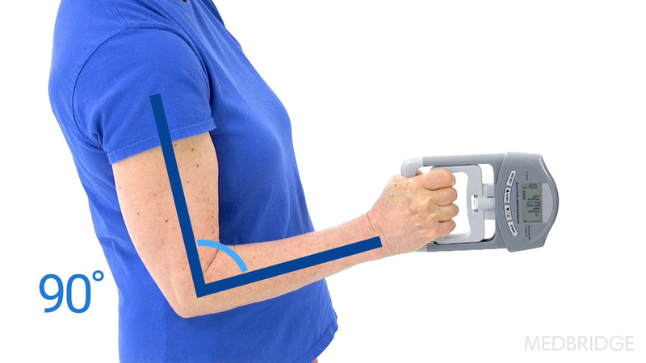
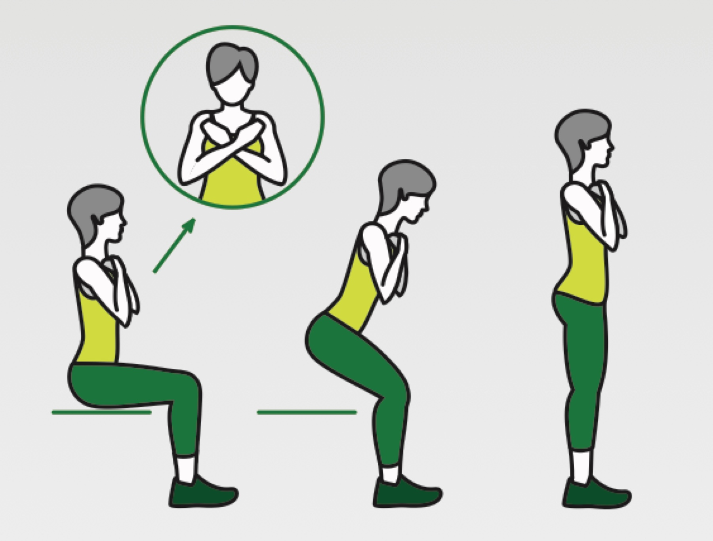
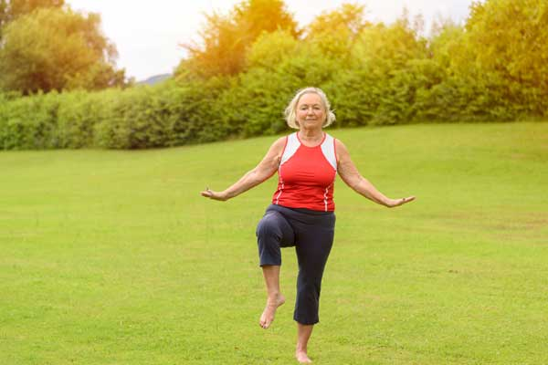
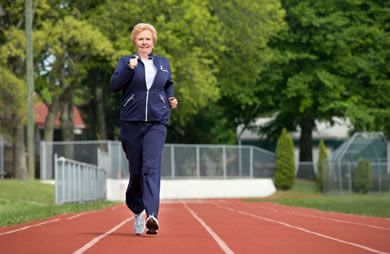

# Artemis Longevity

A comprehensive mobile fitness application designed to empower women aged 30-60 with evidence-based exercise programs, community support, and personalized health insights for healthy aging and longevity.


## Overview

Artemis Longevity combines science-backed fitness assessments, personalized workout plans, and gamification to help women build strength, maintain muscle power, and optimize their health for long-term wellness. The app integrates with health platforms and provides a supportive community for finding workout partners and staying motivated.

## Key Features

### Personalized Exercise Programs
- Evidence-based full-body strength training routines
- Progressive overload systems tailored to fitness levels
- Exercise tutorials with proper form guidance
- Daily workout tracking with historical progress

### Fitness Assessment
- Comprehensive fitness age calculation
- Multi-dimensional testing including:
  - Grip strength assessment
  - Sit-to-stand endurance test
  - Single-leg balance evaluation
  - 1-mile cardio test
- HealthKit integration for automatic data population

### Gamification & Progress Tracking
- Experience points (XP) and leveling system
- Daily streak tracking
- Achievement badges and rewards
- Weekly workout calendar
- Shareable progress milestones

### Community Features
- Location-based workout partner discovery
- Group workout session creation
- Privacy-controlled location sharing
- Interactive community map
- User profiles with fitness interests

### Health Integrations
- **Apple HealthKit**: Automatic sync of activity, heart rate, and workout data
- **Oura Ring**: Sleep quality, readiness scores, and recovery metrics
- Personalized insights based on real health data
- Secure on-device data storage

### Educational Content
- Video tutorials for proper exercise form
- "Learn the Basics" training section
- Exercise-specific guidance and modifications
- Best practices for women's fitness and longevity

## Technology Stack

- **Framework**: React Native with Expo
- **Language**: TypeScript
- **Navigation**: Expo Router (file-based routing)
- **State Management**: React Hooks (useState, useEffect, useContext)
- **Storage**: AsyncStorage for local data persistence
- **UI Components**: Custom components with Expo Linear Gradient
- **Maps**: React Native Maps for community features
- **Health APIs**: 
  - React Native Health (HealthKit)
  - Oura API v2
- **Location**: Expo Location services

## Project Structure

```
artemis-longevity/
├── app/                          # Application screens (file-based routing)
│   ├── (tabs)/                   # Bottom tab navigation
│   │   ├── index.tsx            # Home/Dashboard
│   │   ├── exercises.tsx        # Exercise plans & gamification
│   │   ├── community.tsx        # Workout partners & sessions
│   │   ├── groups.tsx           # Group management
│   │   └── profile.tsx          # User profile & achievements
│   ├── onboarding/              # Onboarding flow
│   │   ├── user-info.tsx       # User information collection
│   │   └── assessment.tsx      # Fitness assessment
│   ├── achievements.tsx         # Achievement gallery
│   ├── oura-connect.tsx         # Oura Ring integration
│   └── _layout.tsx              # Root layout
├── components/                   # Reusable UI components
├── constants/                    # App constants & configurations
│   ├── theme.ts                 # Color schemes & styling
│   ├── achievements.ts          # Achievement definitions
│   └── oura-config.ts          # Oura API configuration
├── hooks/                        # Custom React hooks
│   ├── use-oura-data.ts        # Oura data management
│   └── use-color-scheme.ts     # Theme management
├── services/                     # Business logic & API services
│   ├── oura-api.ts             # Oura Ring API client
│   ├── oura-data-mapper.ts     # Health data mapping
│   ├── achievement-service.ts   # Achievement tracking
│   ├── community-service.ts     # Community features
│   └── location-service.ts      # Location services
├── types/                        # TypeScript type definitions
└── assets/                       # Static assets (images, fonts)
```

## Getting Started

### Prerequisites

- Node.js (v18 or higher)
- npm or yarn
- Expo CLI
- iOS Simulator (for macOS) or Android Emulator
- Xcode (for iOS development)
- Android Studio (for Android development)

### Installation

1. Clone the repository:
```bash
git clone https://github.com/yourusername/artemis-longevity.git
cd artemis-longevity
```

2. Install dependencies:
```bash
npm install
```

3. Set up environment variables (optional):
```bash
# Create constants/oura-config.ts for Oura Ring integration
# Add your Google Maps API key in app.json
```

4. Start the development server:
```bash
npm start
```

5. Run on your preferred platform:
```bash
# iOS
npm run ios

# Android
npm run android

# Web (limited functionality)
npm run web
```

### Development Scripts

```bash
npm start              # Start Expo development server
npm run ios            # Run on iOS simulator
npm run android        # Run on Android emulator
npm run web            # Run in web browser
npm run lint           # Run ESLint
```

## Configuration

### Health Data Integration

#### Apple HealthKit
- Automatically configured via `react-native-health` plugin
- Permissions requested on first use
- No additional setup required

#### Oura Ring
1. Obtain a Personal Access Token from [Oura Cloud](https://cloud.ouraring.com/personal-access-tokens)
2. Enter the token in the app's Oura Connect screen
3. Data syncs automatically once connected

### Google Maps (Community Features)
1. Obtain a Google Maps API key
2. Add to `app.json`:
   - `ios.config.googleMapsApiKey`
   - `android.config.googleMaps.apiKey`

## Features in Detail

### Exercise System

The exercise plan includes evidence-based movements specifically designed for women's longevity:

- **Sit to Stand**: Lower body strength and functional mobility
- **Wall Push-ups**: Upper body strength progression
- **Side Leg Raises**: Hip stability and balance
- **Standing Marches**: Cardiovascular endurance
- **Modified Planks**: Core strength and stability
- **Bicep Curls**: Upper body resistance training
- **Seated Rows**: Back strength and posture
- **Calf Raises**: Lower leg strength and balance

Each exercise includes:
- Recommended sets and repetitions
- XP rewards for completion
- Form guidance and modifications
- Progressive difficulty levels

### Assessment Tools

<div style="display: flex; gap: 10px; flex-wrap: wrap;">
  
  
  
  
</div>

The fitness assessment evaluates:
- **Grip Strength**: Hand strength indicator of overall health
- **Endurance**: Cardiovascular fitness estimation
- **Balance**: Fall risk and stability assessment  
- **Flexibility**: Range of motion evaluation
- **Resting Heart Rate**: Cardiovascular health metric

Results calculate a personalized fitness age to track improvement over time.

## Privacy & Security

- All user data stored locally on device using AsyncStorage
- Health data only accessed with explicit user permission
- Location sharing is optional and user-controlled
- No data shared with third parties
- Oura tokens stored securely on device

## Target Audience

Artemis Longevity is specifically designed for:
- Women aged 30-60
- Individuals focused on healthy aging and longevity
- Beginners to advanced fitness levels
- Those seeking evidence-based exercise programs
- Users wanting community support and accountability

## Contributing

Contributions are welcome! Please feel free to submit a Pull Request.

## License

This project is licensed under the MIT License - see the LICENSE file for details.

## Acknowledgments

- Exercise protocols based on peer-reviewed research in aging and women's health
- UI/UX designed with accessibility and ease of use for all fitness levels
- Community features inspired by the need for social support in fitness journeys

## Support

For support, questions, or feedback, please open an issue in the GitHub repository.

---

**Built with dedication to helping women thrive at every age.**
